# Reporte de Laboratorio: RDP RemoteApp, NPS y Cisco AAA

<div style="text-align: center; margin-top: 50px;">
  <h1>Instituto Tecnológico de Las Américas (ITLA)</h1>
  <br>
  <h2>Tema: Configuración de Servicios RDP RemoteApp, Servidor RADIUS (NPS) y AAA en Equipos de Comunicaciones Cisco</h2>
  <br><br>
  <p><strong>Estudiante:</strong> Alan Daniel Garcia Mendez</p>
  <p><strong>Matrícula:</strong> 2025-1403</p>
  <p><strong>Carrera:</strong> Seguridad Informática</p>
  <p><strong>Asignatura:</strong> Seguridad de Redes</p>
  <p><strong>Docente:</strong> Jonathan Esteban Rondon Corniel</p>
  <p><strong>Fecha de entrega:</strong> 16 de julio de 2026</p>
  <p><strong>Enlace del video:</strong> <a href="https://youtu.be/s9imWZqL1VQ">https://youtu.be/s9imWZqL1VQ</a></p>
  <p><strong>Enlace del repositorio:</strong> <a href="https://github.com/imAlanG16/TSI-203_Semana_9_RemoteApp_RADIUS">https://github.com/imAlanG16/TSI-203_Semana_9_RemoteApp_RADIUS</a></p>
</div>

<div style="page-break-after: always; break-after: page; display: block; height: 1px; overflow: hidden;"></div>

## 1. Introducción

El presente informe técnico describe la implementación de una infraestructura de acceso seguro y control de administración basada en Windows Server 2016 y equipos de comunicaciones Cisco. El objetivo de este laboratorio es doble: en primer lugar, implementar la virtualización de aplicaciones a través de Microsoft Remote Desktop Services (RDS) en las modalidades clásica de RemoteApp y cliente web moderno basado en HTML5 (RemoteApp Web Client), alojando y publicando una intranet corporativa personalizada bajo el servidor web IIS. En segundo lugar, establecer un control de acceso centralizado para la administración de la red (AAA) utilizando Network Policy Server (NPS) como servidor RADIUS, el cual discrimina los privilegios de los administradores en función de grupos de Active Directory para otorgar accesos diferenciados (Privilegio 15 y Privilegio 1) sobre las terminales de red administradas.

## 2. Topología del Laboratorio y Direccionamiento

Para cumplir con los requerimientos específicos del estudiante y asegurar la coherencia del diseño, el direccionamiento IP de la maqueta de red se ha estructurado con base en los segmentos solicitados: **14.3.0.0/24** para la red de clientes y **14.3.50.0/24** para la red de servidores.

La topología consta de tres nodos principales interconectados mediante un Router Cisco que gestiona el enrutamiento inter-VLAN o entre segmentos físicos:

*   **Servidor Windows Server 2016+:** Actúa como Controlador de Dominio (Active Directory), Servidor Web (IIS) y Servidor RADIUS (NPS). Se encuentra ubicado en la red de servidores. Dirección IP: `14.3.50.2/24`.
*   **Router de Comunicaciones Cisco:** Dispositivo de red administrable sobre el cual se aplicarán las políticas de autenticación y autorización AAA. Posee interfaces en ambos segmentos de red actuando como Gateway predeterminado. Direcciones IP: `14.3.0.1/24` (Clientes) y `14.3.50.1/24` (Servidores).
*   **Estación Cliente (VM / Host):** Máquina de pruebas desde la cual se validará el acceso SSH vía RADIUS y el portal web de RemoteApp. Se ubica en la red de clientes. Dirección IP: `14.3.0.50/24`.

<div style="text-align: center; margin-top: 15px; margin-bottom: 15px;">
  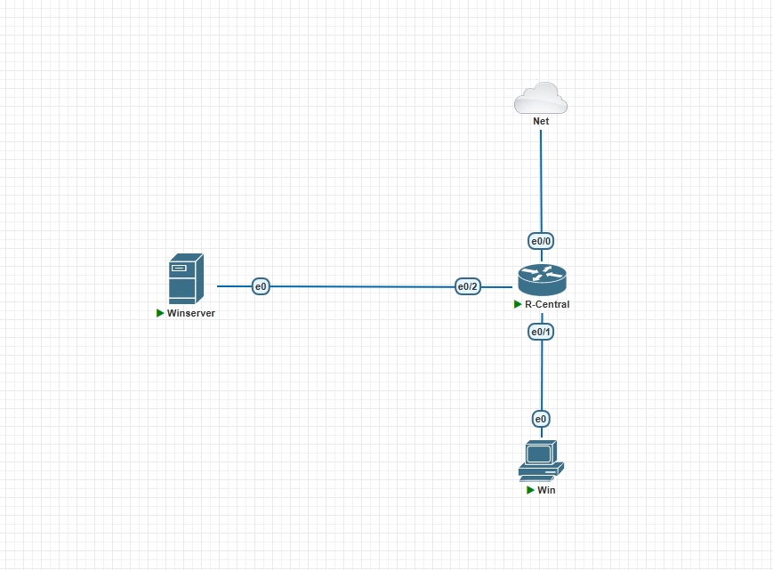
  <p><em>Figura 1: Esquema de topología de interconexión lógica en PNetLab / GNS3</em></p>
</div>

A continuación, se detalla el direccionamiento IP lógico establecido para la práctica:

| Dispositivo | Interfaz | Dirección IP | Máscara de Red | Gateway | Roles de Servicio |
| :--- | :--- | :--- | :--- | :--- | :--- |
| **Router_Cisco** | Ethernet0/0 | 14.3.0.1 | 255.255.255.0 | N/A | Gateway de Clientes (Inside), SSH Daemon |
| **Router_Cisco** | Ethernet0/1 | 14.3.50.1 | 255.255.255.0 | N/A | Gateway de Servidores (Inside), Cliente RADIUS |
| **Router_Cisco** | Ethernet0/2 | IP por DHCP | Variable | N/A | Interfaz WAN / Internet (Outside), NAT Overload |
| **Windows_Server** | Ethernet0 | 14.3.50.2 | 255.255.255.0 | 14.3.50.1 | AD DS, DNS, IIS, RDS Connection Broker, NPS (RADIUS) |
| **Cliente_VM** | Ethernet0 | 14.3.0.50 | 255.255.255.0 | 14.3.0.1 | RDP Client, SSH Client, Web Browser |

## 3. Configuración de Windows Server 2016 en Adelante

### 3.1 Instalación del Rol de Servicios de Escritorio Remoto (RDS)

Para habilitar la publicación de aplicaciones de manera remota mediante RemoteApp, es necesario realizar una instalación estructurada de los Servicios de Escritorio Remoto.

1.  Abra el **Administrador del Servidor (Server Manager)**.
2.  Haga clic en **Administrar > Agregar roles y características**.
3.  En el tipo de instalación, seleccione **Instalación de Servicios de Escritorio Remoto**.
4.  Seleccione **Implementación estándar** para poder distribuir los componentes (en producciones distribuidas) o **Inicio rápido** para entornos consolidados en un solo servidor de prueba. Para este laboratorio, elegimos la opción de implementación basada en sesiones.
5.  Especifique el servidor local `14.3.50.2` para los tres roles esenciales:
    *   **Agente de conexión de Escritorio remoto (RD Connection Broker)**
    *   **Acceso web de Escritorio remoto (RD Web Access)**
    *   **Host de sesión de Escritorio remoto (RD Session Host)**
6.  Complete el asistente y reinicie el servidor para confirmar la instalación de los componentes.

<div style="text-align: center; margin-top: 15px; margin-bottom: 15px;">
  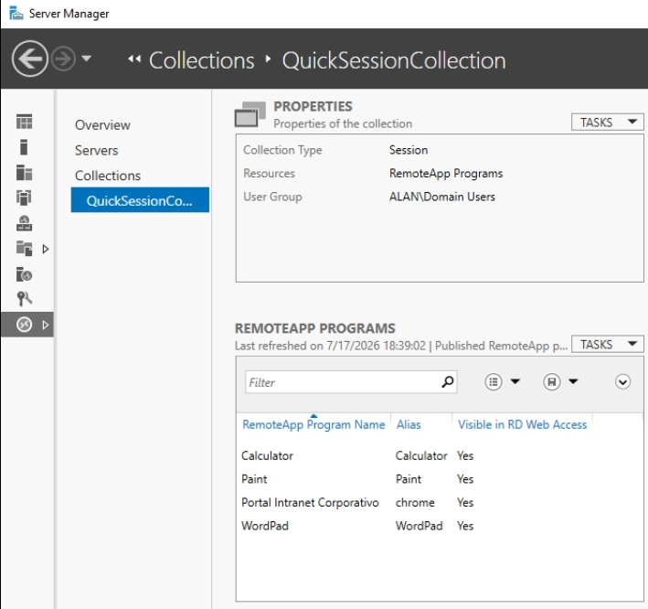
  <p><em>Figura 2: Confirmación del despliegue del rol de Servicios de Escritorio Remoto</em></p>
</div>

### 3.2 Configuración e Instalación del RDP RemoteApp Web Client

El cliente web de RemoteApp permite a los usuarios finales acceder a las aplicaciones publicadas utilizando un navegador compatible con HTML5 (como Chrome, Edge o Firefox) sin necesidad de descargar un cliente RDP clásico. La instalación de esta extensión moderna se realiza mediante PowerShell de forma automatizada:

1.  Abra una consola de **PowerShell** con privilegios de Administrador.
2.  Asegúrese de contar con la versión más reciente del proveedor de PowerShellGet:
    `Install-Module -Name PowerShellGet -Force -SkipPublisherCheck`
3.  Instale el módulo de administración del cliente web:
    `Install-Module -Name RDWebClientManagement -Force`
4.  Descargue la versión más reciente del cliente web HTML5:
    `Install-RDWebClientPackage`
5.  Importe el certificado SSL en el Broker para cifrar la comunicación del cliente. Se requiere un certificado firmado por una entidad de confianza (o autofirmado para pruebas académicas):
    `Import-RDWebClientBrokerCert -Path "C:\Certificados\intranet_vl.pfx"`
6.  Publique el cliente web para que esté disponible en los navegadores:
    `Publish-RDWebClientPackage -Type Production -Latest`

<div style="text-align: center; margin-top: 15px; margin-bottom: 15px;">
  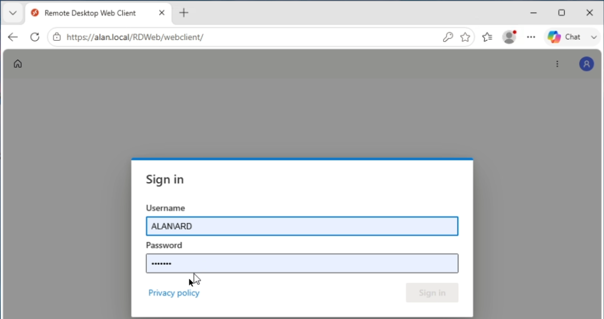
  <p><em>Figura 3: Portal de inicio de sesión del cliente web HTML5 (RD Web Client)</em></p>
</div>

Tras la instalación, el portal web del cliente HTML5 será accesible desde la ruta:
`https://14.3.50.2/RDWeb/webclient/index.html`

### 3.3 Configuración de una Página Personalizada de IIS

Para alojar la intranet corporativa que se publicará a través de la infraestructura RDP, se configura un sitio web personalizado en Internet Information Services (IIS).

1.  Abra el **Administrador de Internet Information Services (IIS)** en Server Manager.
2.  En el árbol de conexiones de la izquierda, expanda el servidor y haga clic derecho en **Sitios > Agregar sitio web**.
3.  Asigne los siguientes parámetros:
    *   **Nombre del sitio:** `VL_Intranet`
    *   **Ruta de acceso física:** `C:\inetpub\wwwroot\VL_Intranet\` (aquí se coloca el archivo `index.html` provisto en los recursos).
    *   **Enlace (Binding):** Protocolo HTTP, dirección IP `14.3.50.2`, Puerto `8080` (se cambia el puerto para no interferir con la página predeterminada de RD Web Access que escucha en los puertos estándar 80 y 443).
4.  Haga clic en **Aceptar** y verifique que el sitio esté iniciado.

<div style="text-align: center; margin-top: 15px; margin-bottom: 15px;">
  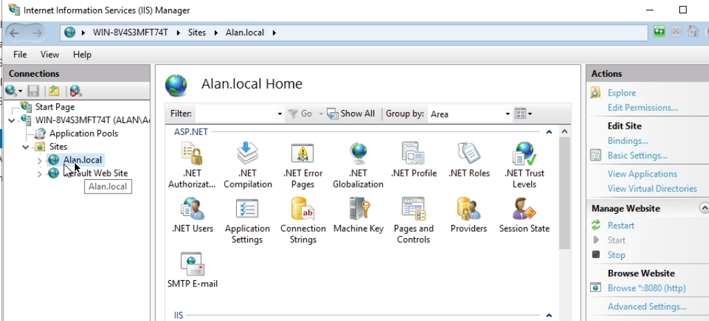
  <p><em>Figura 4: Alta y asignación de bindings para el sitio corporativo personalizado en IIS</em></p>
</div>

### 3.4 Publicación de la Página de IIS en RDP RemoteApp

Para publicar el sitio web de IIS como una aplicación de RemoteApp en lugar de un escritorio completo, debemos empaquetar un navegador web que apunte de manera predeterminada al enlace del portal IIS.

1.  En Server Manager, vaya al panel lateral de **Servicios de Escritorio remoto > Colecciones > QuickSessionCollection** (o la colección que haya creado).
2.  En la sección **Programas RemoteApp**, haga clic en **Tareas > Publicar programas RemoteApp**.
3.  Dado que requerimos publicar un navegador apuntando a un enlace específico, buscaremos el ejecutable de Microsoft Edge en la ruta del sistema. Si no aparece en la lista predeterminada, presione **Agregar** y navegue hasta:
    `C:\Program Files (x86)\Microsoft\Edge\Application\msedge.exe` (o el navegador web preferido).
4.  Seleccione el navegador y complete el asistente de publicación.
5.  Una vez publicado, haga clic derecho sobre el elemento en el panel y seleccione **Propiedades**.
6.  En la sección **Parámetros de línea de comandos**, marque la opción **Exigir el parámetro de línea de comandos siguiente** e ingrese la URL del sitio web de IIS local:
    `http://14.3.50.2:8080/index.html`
7.  En la pestaña **General**, cambie el nombre del programa para mostrar a: `Portal Intranet corporativo V&L`.
8.  Presione **Aplicar** y luego **Aceptar**.

<div style="text-align: center; margin-top: 15px; margin-bottom: 15px;">
  
  <p><em>Figura 5: Propiedades del RemoteApp configuradas para ejecutar Edge con parámetros de URL específicos</em></p>
</div>

## 4. Configuración del Servicio NPS (RADIUS Server)

El Network Policy Server (NPS) centraliza la autenticación y autorización en la infraestructura. Se configurará para atender solicitudes del Router Cisco y mapear el nivel de privilegio de los administradores según su pertenencia a grupos en Active Directory.

### 4.1 Creación de Grupos y Usuarios en Active Directory (AD DS)

Antes de configurar las políticas en NPS, se definen los grupos de usuarios y las cuentas que accederán al router de comunicaciones.

1.  Abra **Usuarios y equipos de Active Directory**.
2.  Cree dos nuevos Grupos de Seguridad:
    *   `RADIUS-Admin-L15`: Destinado a administradores con máximo nivel de acceso (Nivel de privilegio 15).
    *   `RADIUS-User-L1`: Destinado a personal de monitoreo o soporte técnico (Nivel de privilegio 1).
3.  Cree dos usuarios y agréguelos a sus respectivos grupos:
    *   Usuario `ARD` miembro de `RADIUS-Admin-L15`.
    *   Usuario `USR` miembro de `RADIUS-User-L1`.

<div style="text-align: center; margin-top: 15px; margin-bottom: 15px;">
  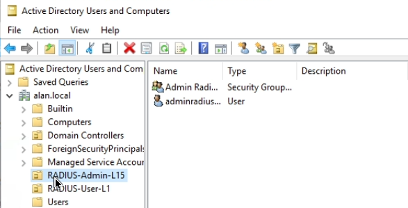
  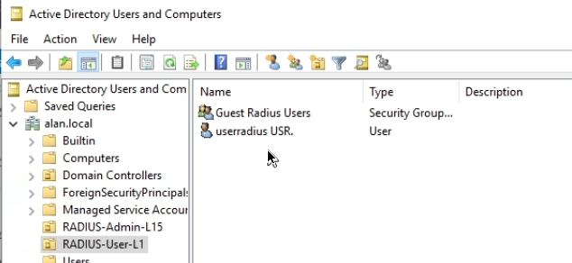
  <p><em>Figura 6: Grupos de Active Directory y asignación de usuarios (L15 para ARD y L1 para USR)</em></p>
</div>

### 4.2 Registro del Router como Cliente RADIUS en NPS

1.  Abra la consola de **Servidor de políticas de red (NPS)**.
2.  Expanda **Clientes y servidores RADIUS**, haga clic derecho en **Clientes RADIUS** y seleccione **Nuevo**.
3.  Complete los siguientes datos:
    *   **Nombre descriptivo:** `Router_Cisco`
    *   **Dirección IP:** `14.3.50.1` (IP de la interfaz del router en el segmento de servidores que envía las peticiones hacia NPS).
    *   **Clave compartida (Shared Secret):** Seleccione Manual e ingrese la contraseña de sincronización del servicio RADIUS: `ClaveSecretaRadius992`.
4.  Haga clic en **Aceptar**.

<div style="text-align: center; margin-top: 15px; margin-bottom: 15px;">
  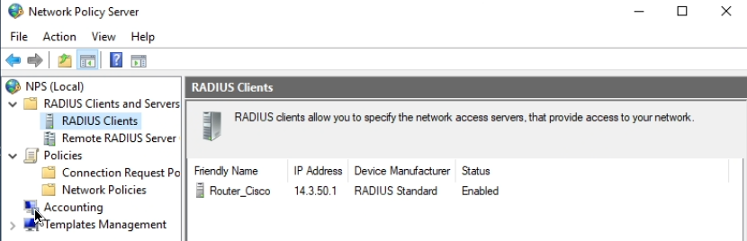
  <p><em>Figura 7: Registro y clave compartida para el Router Cisco en el servidor NPS</em></p>
</div>

### 4.3 Configuración de Políticas de Red (Privilegios 1 y 15)

Para enviar el nivel de privilegio correcto al router Cisco tras un inicio de sesión por SSH exitoso, debemos configurar políticas de red en NPS que inyecten un atributo específico del fabricante (Vendor-Specific Attribute - VSA).

#### Configuración de la Política para Nivel de Acceso 15 (SuperAdministrador)

1.  En la consola NPS, expanda **Políticas** y haga clic en **Políticas de red**.
2.  Haga clic derecho en **Políticas de red > Nueva**.
3.  **Nombre de la política:** `Cisco SSH Level 15 Access`. Tipo de servidor de acceso a red: `Sin especificar`.
4.  **Condiciones:** Agregue las siguientes condiciones obligatorias:
    *   *Grupos de usuarios:* `RADIUS-Admin-L15`
    *   *Nombre descriptivo del cliente:* `Router_Cisco`
5.  **Especificar permiso de acceso:** Seleccione `Acceso concedido`.
6.  **Métodos de autenticación:** Marque únicamente **Autenticación sin cifrar (PAP, SPAP)** (es el protocolo utilizado por defecto en IOS para la verificación de credenciales vía RADIUS). Desmarque otros métodos para evitar incompatibilidades.
7.  **Configuración de Atributos (Paso Crítico):**
    *   Vaya a la pestaña **Configuración** y seleccione **Atributos específicos del proveedor (Vendor-Specific)**.
    *   Haga clic en **Agregar**.
    *   Seleccione el proveedor **Cisco** de la lista (código de proveedor: `9`).
    *   Haga clic en **Agregar** para insertar un atributo de proveedor.
    *   Seleccione el atributo de Cisco **Cisco-AV-Pair** e ingrese el siguiente valor de texto de forma exacta:
        `shell:priv-lvl=15`
    *   Confirme los cambios.

<div style="text-align: center; margin-top: 15px; margin-bottom: 15px;">
  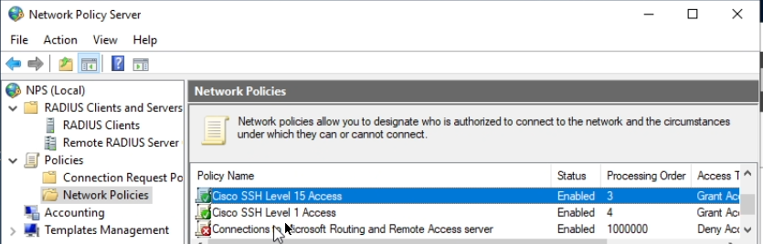
  <p><em>Figura 8: Políticas de red configuradas en el servidor NPS para los niveles de privilegio Cisco</em></p>
</div>

#### Configuración de la Política para Nivel de Acceso 1 (Operador/Soporte)

1.  Haga clic derecho en **Políticas de red > Nueva**.
2.  **Nombre de la política:** `Cisco SSH Level 1 Access`.
3.  **Condiciones:**
    *   *Grupos de usuarios:* `RADIUS-User-L1`
    *   *Nombre descriptivo del cliente:* `Router_Cisco`
4.  **Especificar permiso de acceso:** Seleccione `Acceso concedido`.
5.  **Métodos de autenticación:** Marque únicamente **Autenticación sin cifrar (PAP, SPAP)**.
6.  **Configuración de Atributos:**
    *   Vaya a **Configuración > Atributos específicos del proveedor**.
    *   Agregue el proveedor **Cisco** y configure el atributo **Cisco-AV-Pair** con el valor:
        `shell:priv-lvl=1`
7.  Haga clic en **Aceptar** para guardar la política.
8.  **Orden de evaluación:** Asegúrese en el panel de NPS que estas dos políticas creadas tengan prioridad y estén listadas por encima de cualquier regla de bloqueo predeterminada.

<div style="text-align: center; margin-top: 15px; margin-bottom: 15px;">
  
  <p><em>Figura 9: Listado jerárquico de políticas en NPS con prioridad en la evaluación de accesos</em></p>
</div>

## 5. Configuración del Router (Cisco AAA + RADIUS)

Para habilitar la delegación de accesos al servidor de políticas de red NPS y habilitar la salida a Internet en toda la maqueta, se debe inicializar el direccionamiento de interfaces, NAT y el modelo AAA en el router Cisco a través de su interfaz de comandos de línea (CLI).

A continuación se detallan los pasos y configuraciones aplicados al router:

### 5.1 Configuración de Interfaces y NAT (Traducción de Direcciones)
Para permitir que toda la red local tenga acceso a Internet y asegurar que las subredes se comuniquen correctamente, se configuran las interfaces físicas y el servicio de traducción de direcciones NAT Overload (PAT). Se asigna la interfaz `Ethernet0/0` para los clientes internos (`ip nat inside`), la interfaz `Ethernet0/1` para los servidores (`ip nat inside`), y la interfaz `Ethernet0/2` conectada a la nube pública de internet (`ip nat outside`) obteniendo su dirección IP dinámicamente mediante DHCP:
```cisco
interface Ethernet0/0
 description LAN_Clientes
 ip address 14.3.0.1 255.255.255.0
 ip nat inside
 no shutdown
exit

interface Ethernet0/1
 description LAN_Servidores
 ip address 14.3.50.1 255.255.255.0
 ip nat inside
 no shutdown
exit

interface Ethernet0/2
 description WAN_Internet
 ip address dhcp
 ip nat outside
 no shutdown
exit

! Configuración de la lista de acceso (ACL) para las redes permitidas
access-list 1 permit 14.3.0.0 0.0.0.255
access-list 1 permit 14.3.50.0 0.0.0.255

! Asociación de la ACL con la interfaz externa Ethernet0/2
ip nat inside source list 1 interface Ethernet0/2 overload
```

### 5.2 Credenciales Locales de Respaldo y Contraseña de Configuración
Antes de habilitar AAA, se configura una cuenta de usuario local con máximo nivel de privilegio. Esta cuenta actuará como contingencia para permitir la recuperación de administración local en caso de desconexión del servidor RADIUS:
```cisco
username admin privilege 15 secret LocalAdminPass992
enable secret EnableSecretPass992
```

### 5.3 Habilitación de AAA y Definición del Servidor RADIUS
Se activa el motor de autenticación, autorización y registro (AAA), y se asocia la dirección del servidor Windows Server (`14.3.50.2`) con la clave compartida compartida en NPS:
```cisco
aaa new-model

! Configuración del servidor RADIUS
radius server NPS_SERVER
 address ipv4 14.3.50.2 auth-port 1812 acct-port 1813
 key ClaveSecretaRadius992
```

### 5.4 Métodos de Autenticación, Autorización y Logs (Accounting)
Se definen las directivas de comportamiento para los accesos. La directiva `login` autenticará las terminales usando primero el grupo de servidores RADIUS y, si no están disponibles, recurrirá a la base local. La directiva `exec` recopilará los parámetros de privilegios (VSA) devueltos por el RADIUS para aplicarlos de manera directa al shell del usuario:
```cisco
! Lista de autenticación predeterminada para accesos interactivos (SSH/VTY)
aaa authentication login default group radius local

! Lista de autorización para habilitar el entorno EXEC del usuario
aaa authorization exec default group radius local

! Configuración de logs de auditoría (Accounting)
! Registra el inicio y cierre de sesiones de usuarios
aaa accounting exec default start-stop group radius

! Registra todos los comandos con privilegio 15 introducidos por los administradores
aaa accounting commands 15 default start-stop group radius
```

### 5.5 Aplicación de Políticas a Líneas de Consola y VTY (SSH)
Se configuran las terminales virtuales de comunicación para forzar el uso del protocolo seguro SSH y la autenticación AAA por defecto:
```cisco
ip domain name alan.local
crypto key generate rsa general-keys modulus 2048

ip ssh version 2

line vty 0 4
 transport input ssh
 login authentication default
 authorization exec default
exit
```

## 6. Pruebas de Funcionamiento y Evidencias de Conectividad

### 6.1 Acceso al Sitio Web IIS mediante RDP RemoteApp Clásico

1.  Desde el cliente, inicie sesión en el portal Web clásico de RDS ingresando a la URL:
    `https://14.3.50.2/RDWeb`
2.  Introduzca credenciales autorizadas del dominio Active Directory.
3.  En la cuadrícula de aplicaciones, verá el icono publicado: **Portal Intranet corporativo V&L**.
4.  Haga clic sobre el programa. El cliente RDP local de Windows se abrirá en segundo plano y solicitará acceso.
5.  Una vez establecida la sesión, se iniciará el navegador Microsoft Edge en modo aislado mostrando exclusivamente el portal web personalizado de IIS en su puerto `8080`.

El proceso de acceso y establecimiento de la sesión clásica de RemoteApp se ilustra secuencialmente en las siguientes figuras:

<div style="text-align: center; margin-top: 15px; margin-bottom: 15px;">
  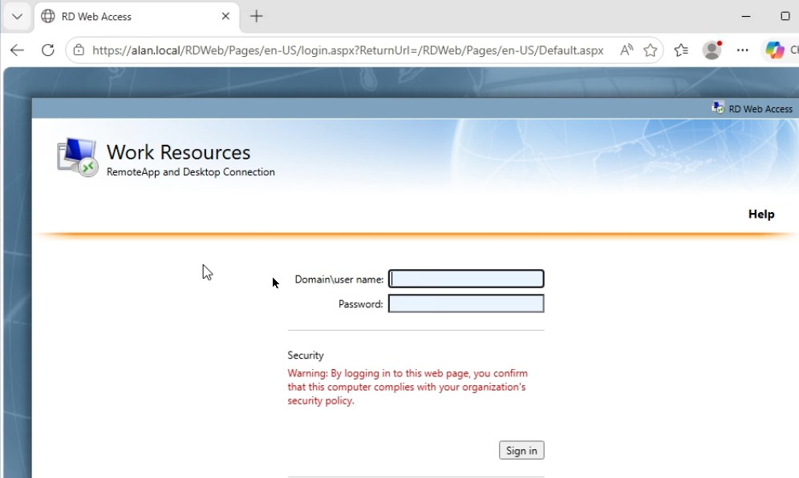
  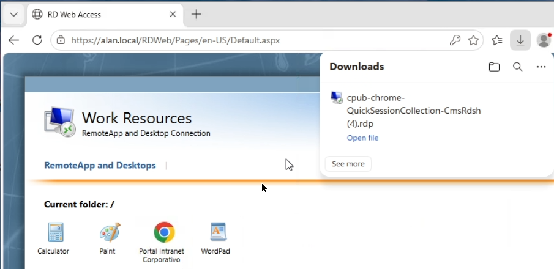
  <p><em>Figura 10: Inicio de sesión en el portal clásico RDWeb Access y descarga del archivo de configuración .rdp</em></p>
</div>

<div style="text-align: center; margin-top: 15px; margin-bottom: 15px;">
  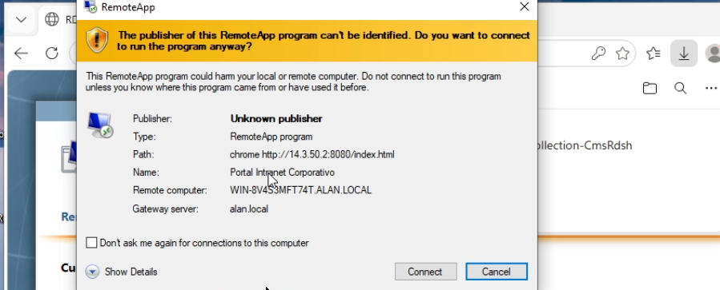
  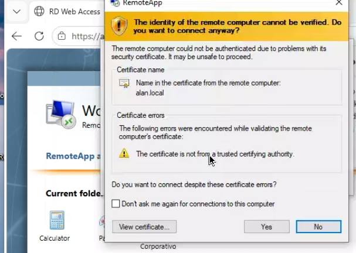
  <p><em>Figura 10.1: Mensajes de advertencia de seguridad del cliente RDP relativos al editor de la aplicación y la firma del certificado alan.local</em></p>
</div>

<div style="text-align: center; margin-top: 15px; margin-bottom: 15px;">
  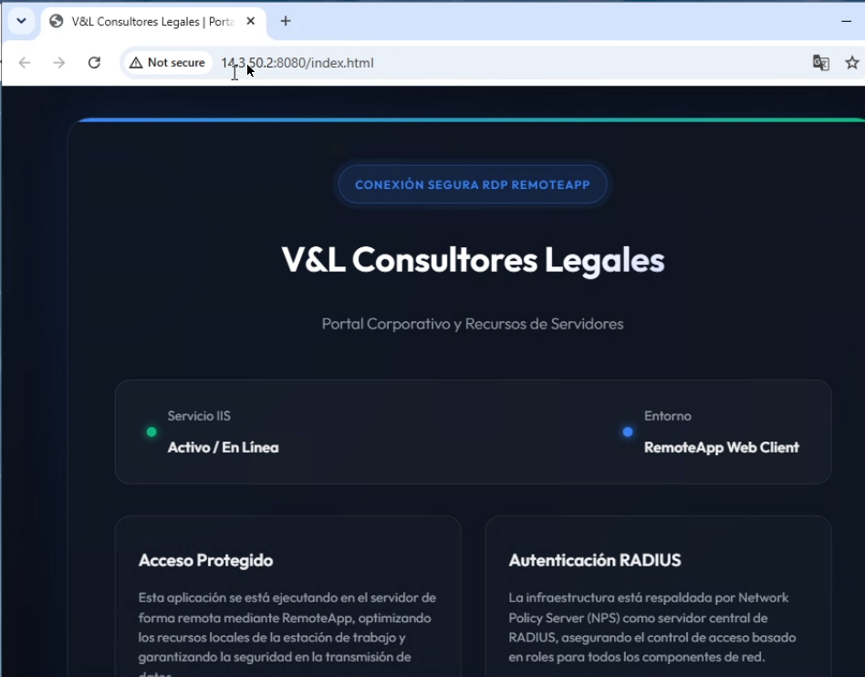
  <p><em>Figura 10.2: Intranet corporativa ejecutándose de forma remota en una ventana aislada a través del cliente clásico RemoteApp</em></p>
</div>

### 6.2 Acceso al Sitio Web IIS mediante RDP RemoteApp Web Client (HTML5)

1.  Desde la estación cliente, acceda mediante navegador web a la dirección:
    `https://14.3.50.2/RDWeb/webclient/index.html`
2.  Inicie sesión con las credenciales correspondientes.
3.  Al autenticarse, aparecerá el portal de aplicaciones HTML5. Haga clic en la aplicación **Portal Intranet corporativo V&L**.
4.  El cliente HTML5 renderizará la sesión de manera nativa dentro del propio navegador. Se observa la intranet con un excelente diseño, bordes difuminados (glassmorphism) y visualización del estado del servicio.

La experiencia de inicio de sesión y despliegue dentro del cliente HTML5 moderno se detalla a continuación:

<div style="text-align: center; margin-top: 15px; margin-bottom: 15px;">
  
  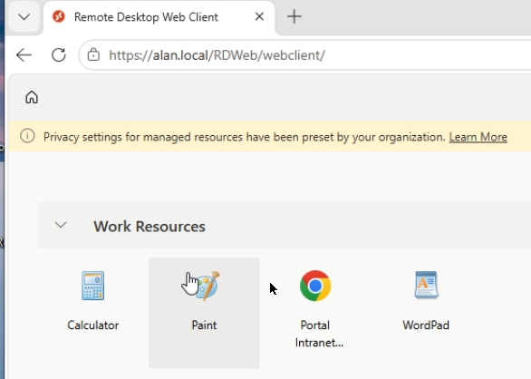
  <p><em>Figura 11: Pantalla de autenticación específica de RD Web Client y catálogo de aplicaciones disponibles</em></p>
</div>

<div style="text-align: center; margin-top: 15px; margin-bottom: 15px;">
  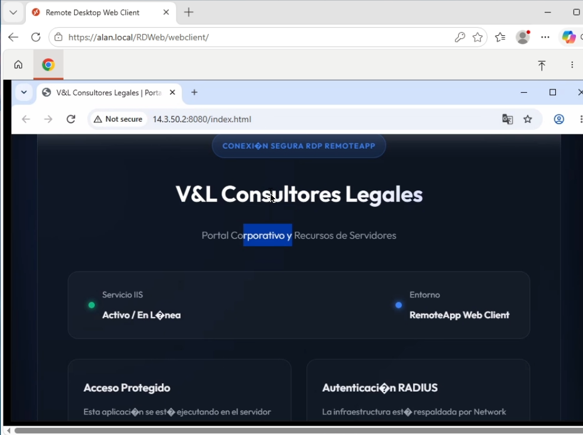
  <p><em>Figura 11.1: Portal intranet cargado de forma responsiva directamente en la pestaña del navegador cliente</em></p>
</div>

### 6.3 Conexión SSH al Router vía RADIUS (Acceso Nivel de Acceso 15)

1.  Desde la máquina cliente (IP `14.3.0.50`), inicie una conexión SSH hacia la IP de Gateway del router (`14.3.0.1`):
    `ssh -l ARD 14.3.0.1`
2.  Ingrese la contraseña del usuario configurada en Active Directory.
3.  Una vez conectado, verifique el símbolo de la consola del router:
    Se visualiza el prompt `Router#` (lo cual confirma que se accedió directamente al modo privilegiado sin necesidad de ingresar el comando `enable`).
4.  Ejecute el comando para confirmar el privilegio:
    `show privilege`
    Retorna: `Current privilege level is 15`.

<div style="text-align: center; margin-top: 15px; margin-bottom: 15px;">
  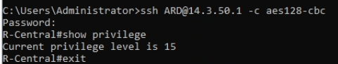
  <p><em>Figura 12: Acceso SSH exitoso y verificación de obtención inmediata de nivel de privilegio 15</em></p>
</div>

### 6.4 Conexión SSH al Router vía RADIUS (Acceso Nivel de Acceso 1)

1.  Establezca conexión SSH con el usuario de soporte:
    `ssh -l USR 14.3.0.1`
2.  Introduzca las credenciales de Active Directory asociadas.
3.  Al ingresar, el prompt que se muestra es `Router>` (modo usuario normal sin privilegios de configuración).
4.  Ejecute el comando:
    `show privilege`
    Retorna de manera correcta: `Current privilege level is 1`.
5.  Si este usuario requiere elevar privilegios de forma eventual, deberá ingresar el comando `enable` e introducir la clave local secreta de habilitación (`EnableSecretPass992`).

<div style="text-align: center; margin-top: 15px; margin-bottom: 15px;">
  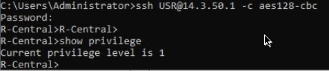
  <p><em>Figura 13: Comprobación de restricción de permisos a Nivel de Privilegio 1 para usuarios operadores</em></p>
</div>

### 6.5 Logs y Depuración de AAA en el Router (Comandos Debug)

Para verificar y diagnosticar el flujo de peticiones AAA y RADIUS desde la CLI del Router Cisco, se ejecutan los comandos de depuración solicitados.

#### Activar Debugging en el Router
```cisco
debug aaa authentication
debug aaa authorization
debug radius
```

#### Salida Esperada en Consola tras una Autenticación Exitosa
Al iniciar la conexión SSH, el router envía un paquete RADIUS Access-Request al servidor NPS `14.3.50.2` desde su interfaz LAN de servidores `14.3.50.1`. El servidor NPS procesa la petición y devuelve un Access-Accept:
```text
*Jul 10 04:45:12.112: RADIUS/ENCODE(0000000A): encoding ip address 14.3.50.1
*Jul 10 04:45:12.113: RADIUS(0000000A): Sending Request to 14.3.50.2:1812 on Ethernet0/1
*Jul 10 04:45:12.114: RADIUS(0000000A): Started timer 5 seconds
*Jul 10 04:45:12.132: RADIUS/DECODE: Access-Accept received from 14.3.50.2 for id 0000000A
*Jul 10 04:45:12.133: RADIUS: Cisco AVpair     [1]   17  "shell:priv-lvl=15"
*Jul 10 04:45:12.134: AAA/AUTHOR/EXEC: Privilege level 15 mapped from RADIUS VSA
```

#### Comandos de Monitoreo y Auditoría
Para verificar la tabla de servidores RADIUS y las sesiones activas en el dispositivo de red, empleamos las herramientas de visualización:
```cisco
show aaa servers
```
*Muestra información de disponibilidad del servidor, estadísticas de paquetes enviados/recibidos y tiempos de respuesta.*

```cisco
show aaa sessions
```
*Detalla las sesiones de comunicación establecidas, el nombre de usuario autenticado, la dirección IP de origen, el tipo de terminal y la duración de la conexión.*

La evidencia de la auditoría y diagnóstico se recopila en las siguientes salidas del router:

<div style="text-align: center; margin-top: 15px; margin-bottom: 15px;">
  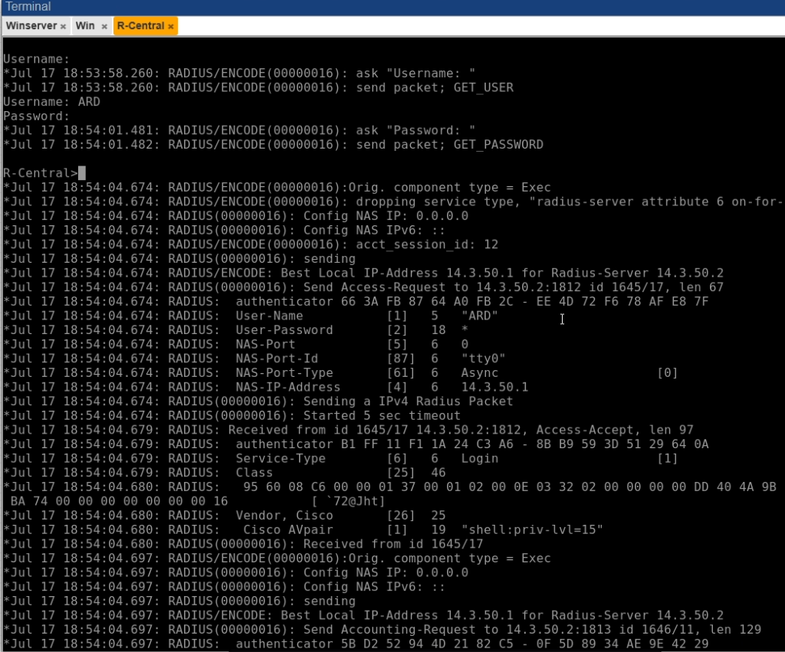
  <p><em>Figura 14: Mensajes de depuración en tiempo real del intercambio de tramas RADIUS Access-Request y Access-Accept</em></p>
</div>

<div style="text-align: center; margin-top: 15px; margin-bottom: 15px;">
  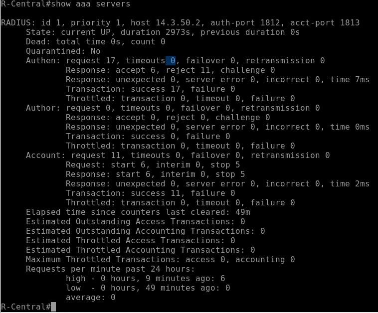
  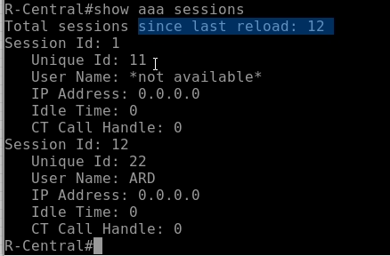
  <p><em>Figura 14.1: Salidas de comandos show aaa servers (estado UP de NPS) y show aaa sessions (usuario ARD conectado)</em></p>
</div>

## 7. Conclusión

La realización de este laboratorio comprueba los beneficios de integrar tecnologías de virtualización de servicios con sistemas de control de acceso basados en la red. RemoteApp y su contraparte Web Client resuelven la disponibilidad de herramientas y portales del negocio (como la intranet IIS) desde cualquier ubicación sin comprometer la seguridad física de los servidores. Por su parte, la combinación de RADIUS (NPS) con AAA en la electrónica de red de Cisco facilita una gestión eficiente de los accesos administrativos, eliminando la necesidad de contraseñas locales idénticas compartidas en múltiples dispositivos y reduciendo la superficie de ataque del entorno tecnológico.
